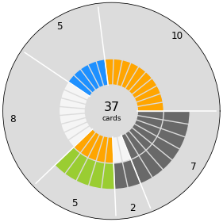

# TFTCG Deck Composition Chart

This Python module allows you to visualize the composition of your TFTCG deck. 
---

## Installation

This project requires Python 3.8+ and the following libraries:

- `matplotlib`
- `numpy`

Install them via pip:

```bash
pip install matplotlib numpy
```

Then clone this repository:

```bash
git clone https://github.com/your-username/polar-deck-plot.git
cd polar-deck-plot
```

---

## Usage

You can use the tool by importing the `Deck` class and the `plot_deck` function.

```python
from polar_deck_plot import Deck, plot_deck
```

### Example

```python
from polar_deck_plot import Deck, plot_deck

# Create a deck with specific card composition
my_deck = Deck(O=10, B=5, W=8, OG=5, WK=2, KK=7)

# Generate the chart
plot_deck(my_deck)
```



---

## Input Options

You can set the number of cards with any combination of icons. All keys default to zero if unspecified.

### Valid icon keys:

| Type        | Icon Keys                                              | Description               |
|-------------|--------------------------------------------------------|---------------------------|
| Single Icon | `'O'`, `'B'`, `'W'`, `'G'`, `'K'`                      | Basic symbols             |
| Double Icon | `'OO'`, `'BB'`, `'OB'`, `'OG'`, `'BG'`, `'WG'`, `'OK'`, `'KB'`, `'WK'`, `'KG'`, `'KK'` | Combinations of 2 symbols |
| Triple Icon | `'OKG'`, `'WOB'`, `'KKK'`, `'OKB'`, `'KKG'`            | Combinations of 3 symbols |
| No Icon     | `'b'`                                                  | Represents blank cards    |

Each key is passed as a keyword argument when creating a `Deck`.

```python
deck = Deck(O=10, OB=3, WK=2, KKK=1)
```

---

## Output

The generated chart includes:

- Colored sectors for each icon or combination  
- Labels and dividers on the inner ring  
- Summary count in the center  

Example chart (coming soon):

 You can save the chart by adding `plt.savefig("deck_chart.png")` after `plot_deck(deck)` in your script.

---

## Project Structure

```
TFTCG-Deck-Composition-Chart/
│
├── polar_deck_plot.py       # Main plotting module
├── README.md                # This file
└── docs/
    └── example_chart.png    # Optional: chart output image
```

---

## Future Improvements

- Support exporting charts as SVG or PNG  
- CLI interface  
- Web app version using Streamlit or Flask  

---

## License

MIT License. See `LICENSE` file for more details.

---

## Contributions

Pull requests are welcome! If you find a bug or want a feature, feel free to open an issue.

---

## Author

Built by [Enrico Borriello](https://github.com/EnricoBorriello)
